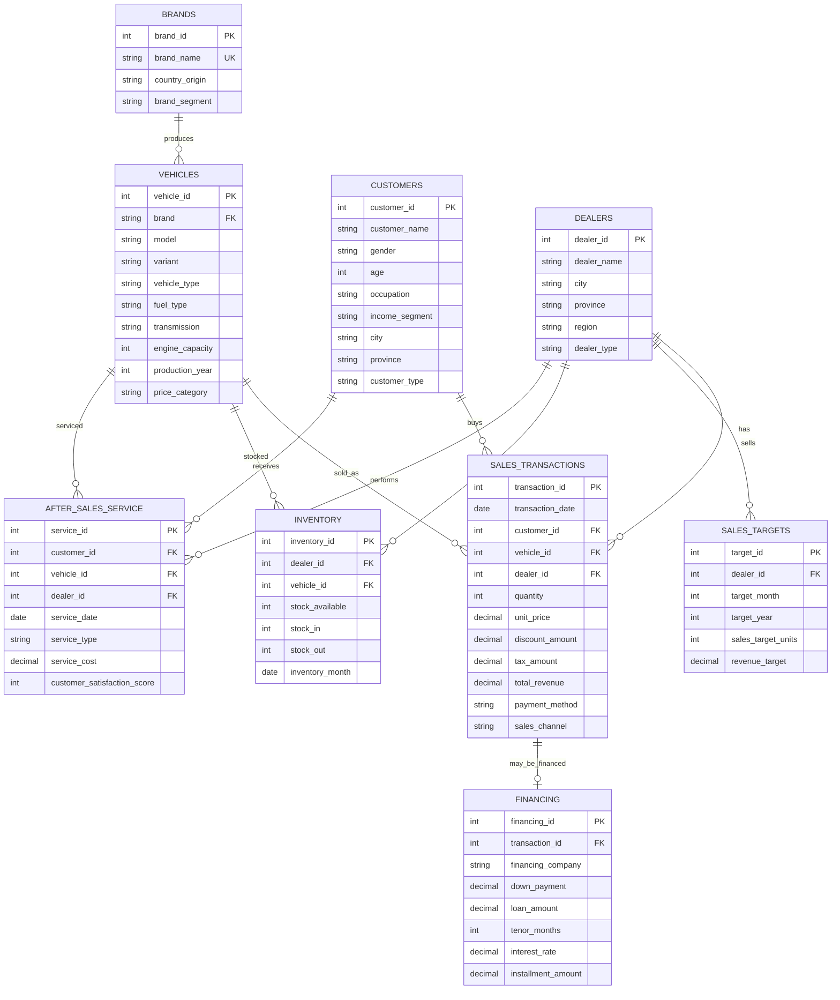

# Indonesia Car Sales Analytics — PostgreSQL

> **An end-to-end SQL analytics case study on a synthetic dataset of 11,013 vehicle sales across the Indonesian market (2020–2025).**

[](https://www.postgresql.org/)
[](https://duckdb.org/)


[](./LICENSE)
[](https://medium.com/@raihanmasyalhaidar/indonesia-car-sales-analytics-using-postgresql-fe752dd75b37)

📰 **Full article on Medium →** [Indonesia Car Sales Analytics using PostgreSQL](https://medium.com/@raihanmasyalhaidar/indonesia-car-sales-analytics-using-postgresql-fe752dd75b37)

---

## 📑 Table of Contents

- [Overview](#overview)
- [Business Problem](#business-problem)
- [Dataset](#dataset)
  - [Design Principles](#design-principles)
  - [Dataset Dictionary](#dataset-dictionary)
  - [Sample Synthetic Data](#sample-synthetic-data)
- [Database Schema (ERD)](#database-schema-erd)
- [Sample Analysis](#sample-analysis) — 3 sample queries + reference to all 14
  - [Sample 1: Overall sales performance](#sample-1--overall-sales-performance)
  - [Sample 2: Brand market share](#sample-2--brand-market-share)
  - [Sample 3: Brand market share over time](#sample-3--brand-market-share-over-time)
  - [All 14 Queries Reference](#all-14-queries--reference)
- [Key Insights](#key-insights)
- [Business Recommendations](#business-recommendations)
- [Conclusion](#conclusion)
- [Repository Structure](#repository-structure)
- [How to Run](#how-to-run)
- [Author](#author)
- [License](#license)

---

## Overview

This project simulates a comprehensive analytics engagement for a fictional national automotive distributor, **AutoNusantara Group**, designed to reflect the complexity and scale of Indonesia's automotive industry. Developed as an end-to-end portfolio case study, it demonstrates the complete lifecycle of a SQL-driven analytics initiative — from designing a normalized relational database schema and generating realistic synthetic datasets to developing layered analytical queries and translating data outputs into actionable business insights and strategic recommendations.

As one of the largest passenger-vehicle markets in Southeast Asia, Indonesia presents a compelling environment for advanced analytical exploration. The market is characterized by the strong dominance of Japanese automotive brands, widespread dependence on financing schemes, sustained demand for MPV and SUV segments, and significant variations in purchasing behavior across regions, particularly between Java and the outer islands. These distinctive market dynamics provide an ideal foundation for showcasing analytical capabilities across multiple business dimensions, including sales performance, product portfolio, regional demand, customer behavior, and financial performance.

> ⚠️ **Disclaimer.** All data in this repository is **synthetic and fictional**, generated specifically for portfolio demonstration. No real customer, dealer, or transaction records are used. Brand names appear only to make the market context realistic; no proprietary information or affiliation is implied.

## Business Problem

AutoNusantara Group is a fictional national automotive distributor operating a multi-brand dealer network across Indonesia. Despite possessing extensive transactional data across sales, financing, inventory, marketing, and after-sales operations, the organization's data landscape remains fragmented across functional areas. This lack of integration restricts analytical visibility and often results in strategic decisions being driven by intuition rather than evidence-based insights.

To support more effective decision-making, the executive team seeks answers to several critical business questions:

- Which vehicle brands and models generate the highest revenue and profitability, rather than simply delivering high sales volumes with thin margins?
- How is market share evolving year over year, and are there specific regions or segments where the company is losing competitive position?
- Which dealers consistently exceed performance targets, and which require operational support and targeted intervention?
- Where should future dealer network expansion be prioritized based on underserved regional demand?
- To what extent does the business rely on financing, and what are the characteristics of its typical customer credit profile?
- Are marketing campaigns generating positive returns on investment, or are resources being allocated to underperforming channels?
- Is inventory aligned with market demand, or is working capital tied up in slow-moving stock while high-demand models face shortages?
- Does after-sales satisfaction influence customer retention and repeat purchases, and where are potential retention gaps occurring throughout the customer journey?

At its core, the business challenge is one of **decision visibility and analytical integration**. AutoNusantara Group requires a unified, queryable analytical foundation that integrates customers, vehicles, dealers, transactions, financing, inventory, marketing activities, and after-sales operations into a single source of truth. Such a framework enables the organization to move beyond fragmented reporting and intuition-based management toward consistent, timely, and data-driven decision-making.

## Dataset

All datasets used in this project are entirely synthetic and were generated exclusively for demonstration purposes. No real customer, dealer, financing, or transaction records were utilized. However, the data generation process was intentionally designed to replicate the structure, distribution patterns, and statistical characteristics of Indonesia's automotive industry, ensuring that the resulting analyses remain realistic, interpretable, and relevant to real-world business scenarios.

### Design Principles

- **Market Realism:** Brand distribution reflects the Indonesian automotive landscape, with dominant market players such as Toyota, Daihatsu, Honda, Mitsubishi, and Suzuki accounting for the largest shares, while emerging brands, premium manufacturers, and EV entrants represent smaller market segments.
- **Product Realism:** The vehicle portfolio is weighted toward MPVs and SUVs, consistent with Indonesian consumer preferences, while sedans, hatchbacks, and pickup trucks contribute comparatively lower sales volumes.
- **Geographic Realism:** Demand is concentrated in Java, particularly DKI Jakarta, West Java, and East Java, while Sumatra, Kalimantan, Sulawesi, and Eastern Indonesia contribute meaningful but proportionally smaller volumes.
- **Financial Realism:** Most vehicle purchases are assumed to be financed through credit facilities, with down payment amounts, loan tenors, and interest rates generated within commercially plausible ranges, including interest rates between **3.5% and 9.5%** and repayment periods ranging from **12 to 60 months**.
- **Temporal Realism:** Sales patterns incorporate major market dynamics observed in recent years, including a decline in transaction volumes during 2020 due to pandemic-related disruptions, a strong recovery in 2021, and more moderate growth in subsequent periods.

### Dataset Dictionary

The project consists of **10 interconnected tables** that collectively represent the end-to-end operations of a national automotive distributor.

| Table | Rows | Description |
|---|---:|---|
| `customers` | 4,500 | Customer profiles and segmentation, including demographics, occupation, income segment, location, and customer type. |
| `vehicles` | 87 | Vehicle master data covering brands, models, variants, specifications, and market segments. |
| `dealers` | 120 | Information on dealership locations, operating regions, and dealer classifications. |
| `sales_transactions` | 11,013 | Core sales records capturing customers, vehicles sold, dealers, revenue, discounts, taxes, payment methods, and sales channels. |
| `brands` | 18 | Reference data describing brand origins and positioning within the market. |
| `sales_targets` | 8,640 | Monthly sales and revenue targets used to evaluate dealer performance. |
| `inventory` | 8,744 | Dealer-level stock availability and inventory movements to assess supply-demand alignment. |
| `marketing_campaigns` | 150 | Campaign activities, promotional channels, campaign costs, durations, and target markets. |
| `financing` | 6,592 | Credit-related information, including down payments, loan values, interest rates, and repayment terms. |
| `after_sales_service` | 6,718 | Service activities and customer satisfaction metrics used to analyze retention and ownership experience. |

> 📖 For the full column-level data dictionary, see [`docs/data_dictionary.md`](./docs/data_dictionary.md).

### Sample Synthetic Data

The following **INSERT statements** provide representative samples from each table. The full dataset was generated programmatically at scale; these examples illustrate the database structure, value ranges, and relationships between tables.

<details><summary><b>📄 View sample INSERT statements</b></summary>

**1. brands table**
```sql
INSERT INTO brands (brand_id, brand_name, country_origin, brand_segment) VALUES
(1,  'Toyota',        'Japan',   'Mass-Market'),
(2,  'Daihatsu',      'Japan',   'Mass-Market'),
(3,  'Honda',         'Japan',   'Mass-Market');
```

**2. vehicles table**
```sql
INSERT INTO vehicles (vehicle_id, brand, model, variant, vehicle_type,
    fuel_type, transmission, engine_capacity, production_year, price_category) VALUES
(101, 'Toyota',     'Avanza',       '1.5 G CVT',   'MPV',       'Gasoline','CVT',       1496, 2023, 'Entry'),
(102, 'Toyota',     'Innova Zenix', '2.0 V CVT',   'MPV',       'Gasoline','CVT',       1987, 2024, 'Mid'),
(104, 'Daihatsu',   'Xenia',        '1.3 R MT',    'MPV',       'Gasoline','Manual',    1329, 2023, 'Entry');
```

**3. dealers table**
```sql
INSERT INTO dealers (dealer_id, dealer_name, city, province, region, dealer_type) VALUES
(1, 'Nusantara Motor Jakarta Selatan 001','Jakarta Selatan','DKI Jakarta','Java','Flagship'),
(2, 'Nusantara Motor Bandung 002',        'Bandung',        'West Java',  'Java','Standard'),
(3, 'Nusantara Motor Surabaya 003',       'Surabaya',       'East Java',  'Java','Flagship');
```

**4. customers table**
```sql
INSERT INTO customers (customer_id, customer_name, gender, age, occupation,
    income_segment, city, province, customer_type) VALUES
(1001,'PT Lestari Mandiri','N/A',   0, 'Corporate',    'High',         'Bogor',         'West Java',     'Corporate'),
(1002,'Reza Wijaya',        'Male', 41,'Professional', 'Middle',       'Jakarta Pusat', 'DKI Jakarta',   'Individual'),
(1003,'Putra Permana',      'Male', 31,'Manager',      'Middle',       'Metro',         'Lampung',       'Individual');
```

**5. sales_transactions table**
```sql
INSERT INTO sales_transactions (transaction_id, transaction_date, customer_id,
    vehicle_id, dealer_id, quantity, unit_price, discount_amount, tax_amount,
    total_revenue, payment_method, sales_channel) VALUES
(500001,'2023-10-18',1210,140, 45,1,173700000,        0, 19107000, 192807000,'Cash',  'Showroom'),
(500002,'2025-06-15',4445,123, 88,1,786000000,  4300000, 85987000, 867687000,'Credit','Showroom'),
(500003,'2024-05-10',3423,107, 50,1,375900000, 11600000, 40073000, 404373000,'Credit','Showroom');
```

**6. financing table**
```sql
INSERT INTO financing (financing_id, transaction_id, financing_company,
    down_payment, loan_amount, tenor_months, interest_rate, installment_amount) VALUES
(9001, 500002, 'Mandiri Tunas Finance', 242600000,  625087000, 60, 9.23, 15226000),
(9002, 500003, 'Mandiri Tunas Finance', 115600000,  288773000, 24, 4.69, 13160000),
(9003, 500004, 'FIFGROUP',               93000000,  197154000, 36, 6.80,  6890000);
```

</details>

## Database Schema (ERD)



Reading the diagram: a single brand has many vehicles; each of customers, vehicles, and dealers participates in many sales transactions; each sale may have at most one financing record (cash purchases have none). Dealers own monthly targets and per-vehicle inventory snapshots, while customers accumulate after-sales service visits over the life of ownership.

## Sample Analysis

The repository contains **14 analytical SQL queries** in [`queries/`](./queries/), with their pre-computed results in [`results/`](./results/). Three representative samples are shown below to illustrate the SQL techniques used — from foundational aggregations to multi-CTE window-function pipelines. The full narrative for all 14 queries is in the [Medium article](https://medium.com/@raihanmasyalhaidar/indonesia-car-sales-analytics-using-postgresql-fe752dd75b37).

### Sample 1 — Overall sales performance

_Foundational aggregation — establishes the headline KPIs that anchor the rest of the analysis._

```sql
-- Query 1: Overall sales performance
SELECT
    SUM(quantity)                              AS total_units_sold,
    SUM(total_revenue)                         AS total_revenue,
    ROUND(SUM(total_revenue) / SUM(quantity))  AS avg_selling_price,
    SUM(discount_amount)                       AS total_discounts,
    SUM(tax_amount)                            AS total_tax_collected
FROM sales_transactions;
```

**Result:**

| Metric | Value |
| :--- | :--- |
| Total units sold | 11,013 |
| Total revenue (IDR) | 5,041,921,809,000 |
| Avg selling price (IDR) | 457,815,473 |
| Total discounts (IDR) | 165,354,800,000 |
| Total tax (IDR) | 499,649,909,000 |

Over the six-year period, AutoNusantara Group recorded sales of **11,013 vehicles**, generating **Rp 5.04 trillion** in net revenue, with an **Average Selling Price** of **Rp 458 million per unit**. Total discounts amounted to **Rp 165 billion** — only **3.51%** of the Rp 4.71 trillion gross list value — indicating disciplined pricing and limited reliance on promotional discounting.

---

### Sample 2 — Brand market share

_Window function technique — uses `SUM(SUM(...)) OVER ()` to compute the grand total alongside each group's subtotal in a single pass._

```sql
-- Query 4: Brand market share (% of total units)
SELECT
    v.brand,
    SUM(st.quantity)                                       AS units_sold,
    ROUND(100.0 * SUM(st.quantity)
        / SUM(SUM(st.quantity)) OVER (), 2)                AS market_share_pct
FROM sales_transactions st
JOIN vehicles v ON v.vehicle_id = st.vehicle_id
GROUP BY v.brand
ORDER BY market_share_pct DESC;
```

**Result** _(18 rows; showing top 10):_

| Brand | Units | Market Share % |
| :--- | ---: | ---: |
| Toyota | 3,302 | 29.98 |
| Honda | 1,887 | 17.13 |
| Daihatsu | 1,732 | 15.73 |
| Suzuki | 1,097 | 9.96 |
| Mitsubishi | 1,062 | 9.64 |
| Hyundai | 360 | 3.27 |
| Wuling | 295 | 2.68 |
| BYD | 286 | 2.60 |
| Mazda | 177 | 1.61 |
| Nissan | 159 | 1.44 |

Toyota accounts for **30.0%** of total sales volume; the top three brands collectively contribute **62.8%**, while the top five command **82.4%**. The remaining 13 brands compete for just **17.6%** of total market volume — a highly concentrated market where the majority of demand is captured by a small number of dominant brands.

---

### Sample 3 — Brand market share over time

_Advanced multi-CTE pipeline — combines window functions (`SUM OVER PARTITION BY`, `ROW_NUMBER`, `LAG`) to track competitive position year over year._

```sql
-- Query 13: Brand market share over time (top 5 each year)
WITH yearly AS (
    SELECT
        v.brand,
        EXTRACT(YEAR FROM st.transaction_date) AS yr,
        SUM(st.quantity) AS units
    FROM sales_transactions st
    JOIN vehicles v
        ON v.vehicle_id = st.vehicle_id
    GROUP BY
        v.brand,
        EXTRACT(YEAR FROM st.transaction_date)
),

ranked AS (
    SELECT
        brand,
        yr,
        units,
        ROUND(
            100.0 * units / SUM(units) OVER (PARTITION BY yr),
            2
        ) AS market_share_pct,
        ROW_NUMBER() OVER (
            PARTITION BY yr
            ORDER BY units DESC
        ) AS rank_in_year
    FROM yearly
),

top5 AS (
    SELECT *
    FROM ranked
    WHERE rank_in_year <= 5
),

final AS (
    SELECT
        brand,
        yr,
        units,
        market_share_pct,
        LAG(market_share_pct) OVER (
            PARTITION BY brand
            ORDER BY yr
        ) AS prev_year_market_share_pct,
        ROUND(
            market_share_pct
            - LAG(market_share_pct) OVER (
                PARTITION BY brand
                ORDER BY yr
            ),
            2
        ) AS market_share_change_pct
    FROM top5
)

SELECT *
FROM final
ORDER BY brand, yr;
```

**Result** _(30 rows; showing first 12):_

| Brand | Year | Units | Share % | Prev Yr Share % | Change |
| :--- | ---: | ---: | ---: | ---: | ---: |
| Daihatsu | 2020 | 195 | 16.94 | — | — |
| Daihatsu | 2021 | 267 | 17.23 | 16.94 | +0.29 |
| Daihatsu | 2022 | 287 | 15.57 | 17.23 | -1.66 |
| Daihatsu | 2023 | 314 | 15.98 | 15.57 | +0.41 |
| Daihatsu | 2024 | 318 | 14.60 | 15.98 | -1.38 |
| Daihatsu | 2025 | 351 | 15.09 | 14.60 | +0.49 |
| Honda | 2020 | 214 | 18.59 | — | — |
| Honda | 2021 | 249 | 16.06 | 18.59 | -2.53 |
| Honda | 2022 | 305 | 16.55 | 16.06 | +0.49 |
| Honda | 2023 | 336 | 17.10 | 16.55 | +0.55 |
| Honda | 2024 | 375 | 17.22 | 17.10 | +0.12 |
| Honda | 2025 | 408 | 17.54 | 17.22 | +0.32 |

The top five brand ranking (**Toyota, Honda, Daihatsu, Suzuki, Mitsubishi**) remained unchanged throughout the 2020–2025 period. Toyota's share rose from 28.67% to 29.84%, peaking at 31.14% in 2022. Honda recovered from a 2021 dip back to 17.54% by 2025, while Suzuki posted consecutive gains in 2024–2025 to reach its highest level of the period (10.83%).

---

### All 14 Queries — Reference

Every SQL file and its pre-computed result are included in the repository. Click through to explore.

| # | Query | Technique | SQL | Result |
|---:|---|---|:---:|:---:|
| 1 | Overall sales performance | Aggregation | [📄 SQL](./queries/01_overall_sales_performance.sql) | [📊 CSV](./results/01_overall_sales_performance.csv) |
| 2 | Monthly and yearly trend | EXTRACT + time-series GROUP BY | [📄 SQL](./queries/02_monthly_yearly_trend.sql) | [📊 CSV](./results/02_monthly_yearly_trend.csv) |
| 3 | Brand ranking by units and revenue | RANK() window (dual ranking) | [📄 SQL](./queries/03_brand_ranking.sql) | [📊 CSV](./results/03_brand_ranking.csv) |
| 4 | Brand market share | SUM(SUM()) OVER () for total | [📄 SQL](./queries/04_brand_market_share.sql) | [📊 CSV](./results/04_brand_market_share.csv) |
| 5 | Best-selling car models | GROUP BY + LIMIT | [📄 SQL](./queries/05_best_selling_models.sql) | [📊 CSV](./results/05_best_selling_models.csv) |
| 6 | Vehicle type / fuel / transmission | Multi-attribute GROUP BY + share | [📄 SQL](./queries/06_vehicle_type_fuel_trans.sql) | [📊 CSV](./results/06_vehicle_type_fuel_trans.csv) |
| 7 | Sales by region, province, city | Geographic hierarchy aggregation | [📄 SQL](./queries/07_sales_by_region.sql) | [📊 CSV](./results/07_sales_by_region.csv) |
| 8 | Dealer-expansion opportunity | CTE + window AVG benchmark + CASE | [📄 SQL](./queries/08_expansion_opportunity.sql) | [📊 CSV](./results/08_expansion_opportunity.csv) |
| 9 | Customer segmentation | CASE banding + GROUP BY | [📄 SQL](./queries/09_customer_segmentation.sql) | [📊 CSV](./results/09_customer_segmentation.csv) |
| 10 | Average price, discount & rate | Aggregation + NULLIF guard | [📄 SQL](./queries/10_price_discount_brand.sql) | [📊 CSV](./results/10_price_discount_brand.csv) |
| 11 | Cash vs Credit and financing profile | LEFT JOIN + window share | [📄 SQL](./queries/11_payment_financing.sql) | [📊 CSV](./results/11_payment_financing.csv) |
| 12 | Marketing campaign ROI | CTE with date-range JOIN | [📄 SQL](./queries/12_marketing_roi.sql) | [📊 CSV](./results/12_marketing_roi.csv) |
| 13 | Brand market share over time | Multi-CTE + ROW_NUMBER + LAG | [📄 SQL](./queries/13_brand_share_over_time.sql) | [📊 CSV](./results/13_brand_share_over_time.csv) |
| 14 | Company YoY units & revenue growth | CTE + LAG window function | [📄 SQL](./queries/14_yoy_growth.sql) | [📊 CSV](./results/14_yoy_growth.csv) |

For the full narrative findings and business interpretation of each query, read the [Medium article](https://medium.com/@raihanmasyalhaidar/indonesia-car-sales-analytics-using-postgresql-fe752dd75b37).
## Key Insights

After conducting a series of analyses across sales performance, product portfolio, customer demographics, regional demand, financing patterns, and marketing effectiveness, several key insights emerged that provide a comprehensive view of AutoNusantara Group's business performance during the 2020–2025 period.

### Commercial Performance

- **Strong Business Growth:** AutoNusantara Group sold **11,013 vehicles** and generated **Rp 5.04 trillion** in revenue during the six-year period, with an average selling price of **Rp 458 million per unit**.
- **Sustained Revenue and Volume Expansion:** Vehicle sales increased from **1,151 units in 2020** to **2,326 units in 2025**, representing cumulative growth of **102.1%**, while revenue grew by **106.2%** over the same period. The highest annual growth was recorded in **2021**, with unit sales and revenue increasing by **34.7%** and **34.8%**, respectively.

### Brand & Product Performance

- **Market Leadership Concentrated Among Major Brands:** **Toyota** remained the market leader with **30.0% market share**, while the top three brands (**Toyota, Honda, and Daihatsu**) collectively accounted for **62.8%** of total sales volume. The top five brands contributed **82.4%** of overall market volume.
- **Stable Competitive Landscape:** The ranking of the top five brands remained unchanged throughout the analysis period, with **Toyota, Honda, Daihatsu, Suzuki, and Mitsubishi** consistently occupying the first through fifth positions, respectively.
- **Best-Selling Vehicle Models:** The **Toyota Yaris Cross** was the highest-selling model with **680 units**, followed by the **Toyota Camry** (**679 units**) and **Toyota Rush** (**661 units**). The top five models generated **3,056 units**, representing **27.7%** of total sales volume.
- **Vehicle Configuration Mix:** The **MPV–Gasoline–Manual** configuration recorded the highest sales volume with **1,575 units (14.3%)**, followed by **SUV–Gasoline–Manual** (**1,450 units; 13.2%**) and **SUV–Gasoline–CVT** (**923 units; 8.4%**).

### Regional Performance

- **Sales Concentrated in Key Urban Markets:** **Yogyakarta** recorded the highest city-level sales volume with **751 units**, followed by **Sleman** (**641 units**) and **Magelang** (**549 units**). Eight of the twelve highest-performing cities were located in Java.
- **Highest Sales per Dealer Ratios:** The network average reached **91.5 units per dealer**. **East Java** recorded the highest ratio at **98.7 units per dealer**, followed by **Papua** (**98.0**) and **Lampung** (**97.6**). A total of **nine provinces** recorded sales-per-dealer levels above the network average.

### Customer Profile

- **Core Customer Segments:** The **25–34 Middle-income** segment generated the highest purchasing activity, recording **1,002 transactions** and approximately **Rp 493 billion** in revenue. Across all age categories, the **Middle-income** segment consistently recorded the highest purchase volumes and revenue contribution.

### Pricing & Revenue

- **Limited Variation in Brand Discount Rates:** Discount rates ranged from **3.29% to 4.06%** across brands. **Volvo** recorded the highest discount rate (**4.06%**), while **Wuling EV** reported the lowest (**3.29%**).
- **Revenue Contribution Led by Toyota:** **Toyota** generated the highest net revenue at approximately **Rp 1.54 trillion**, significantly exceeding all other brands in the portfolio. Meanwhile, **Lexus** recorded the highest average selling price at approximately **Rp 1.65 billion per vehicle**.

### Financing & Marketing

- **Credit Financing as the Primary Payment Method:** Credit transactions accounted for **65.9%** of all vehicle purchases (**6,592 transactions**), compared with **34.1%** completed through cash payments. The average financed purchase included a **Rp 139 million down payment**, a **35.9-month tenor**, and an average **interest rate of 6.49%**.
- **Strong Marketing Campaign Performance:** The **Toyota Launch 2024** campaign achieved the highest ROI at **44.75**, followed by **Honda Tukar Tambah 2023** (**33.85**) and **Toyota Year-End 2025** (**31.34**). Toyota accounted for **seven of the twelve highest-ROI campaigns**, while Honda contributed the remaining five.

## Business Recommendations

Based on the findings from the sales, customer, regional, financing, and marketing analyses, several strategic recommendations can be considered to support sustainable growth, improve operational effectiveness, and strengthen overall business performance.

1. **Strengthen Focus on High-Contributing Brands and Models.** Toyota contributed **30.0% of total sales volume**, while the top five vehicle models accounted for **27.7% of overall sales**. Inventory planning, marketing initiatives, and dealer sales programs should prioritize these high-contributing brands and models to ensure product availability and maximize revenue opportunities.
2. **Maintain Leadership in Core Vehicle Segments.** The highest sales volumes were concentrated in **MPV–Gasoline–Manual** and **SUV–Gasoline–Manual** configurations. Product planning, inventory allocation, and promotional activities should continue to align with demand patterns observed in these vehicle categories.
3. **Prioritize Expansion in High-Performing Provinces.** Provinces such as **East Java, Papua, and Lampung** recorded the highest sales-per-dealer ratios, exceeding the network average of **91.5 units per dealer**. These markets should be evaluated as potential candidates for network expansion and increased market coverage.
4. **Increase Market Penetration Outside Major Urban Centers.** While many of the highest-performing cities are located in Java, several cities outside the island, including **Bitung, Parepare, and Padang**, also demonstrated strong sales performance. Additional sales and marketing initiatives can be explored in these markets to support future growth.
5. **Develop Targeted Customer Acquisition Strategies.** Customers aged **25–54 years**, particularly within the **Middle-income** segment, generated the largest share of transactions and revenue. Marketing campaigns, product offerings, and financing programs should be tailored to the characteristics and purchasing behavior of these customer groups.
6. **Optimize Brand-Level Pricing and Discount Management.** Discount rates varied across brands, ranging from **3.29% to 4.06%**. Regular monitoring of discount effectiveness can help ensure pricing consistency and maintain alignment between sales performance and profitability objectives.
7. **Strengthen Partnerships with Financing Providers.** As **65.9% of vehicle purchases** were completed through credit financing, collaboration with financing partners remains essential. Enhancing financing options, approval processes, and promotional financing programs may help support transaction growth across key customer segments.
8. **Replicate High-Performing Marketing Campaign Practices.** Several campaigns, particularly **Toyota Launch 2024**, **Honda Tukar Tambah 2023**, and **Toyota Year-End 2025**, delivered the highest ROI levels during the analysis period. Evaluating the strategies, channels, and execution approaches used in these campaigns can provide valuable input for future marketing initiatives.
9. **Leverage Market Leadership to Sustain Revenue Growth.** The top five brands collectively accounted for **82.4% of total sales volume**, while Toyota generated approximately **Rp 1.54 trillion** in revenue. Continued investment in leading brands, combined with portfolio diversification initiatives, can help maintain market position while supporting long-term growth objectives.
10. **Implement Data-Driven Performance Monitoring.** Establishing regular monitoring of key performance indicators — including sales growth, market share, dealer productivity, financing penetration, and marketing ROI — can improve decision-making and provide early visibility into changing market conditions.

## Conclusion

This project successfully demonstrates the application of SQL and relational database design to address complex business questions within Indonesia's automotive industry. By integrating data across sales, customers, vehicles, dealers, financing, marketing, and inventory into a unified analytical framework, the project provides a comprehensive view of business performance and enables data-driven decision-making across multiple operational and strategic dimensions.

The analysis highlights several key findings. AutoNusantara Group achieved strong growth throughout the 2020–2025 period, with sales volume and revenue increasing by more than 100%. The market remained highly concentrated, with Toyota maintaining a dominant position and the top five brands accounting for more than 80% of total sales volume. Demand was primarily driven by MPV and SUV segments, concentrated in major urban markets, and supported largely by credit financing, which represented nearly two-thirds of all vehicle purchases. Customer activity was strongest among middle-income consumers aged 25–54, while several provinces demonstrated higher sales-per-dealer ratios than the network average, indicating potential opportunities for future expansion.

Overall, the project illustrates how structured data analysis can transform large volumes of transactional data into meaningful business insights. Beyond measuring historical performance, the analytical outputs provide a foundation for evaluating market position, customer behavior, regional demand, financing patterns, and marketing effectiveness. The resulting insights and recommendations demonstrate the value of analytics in supporting strategic planning, operational optimization, and long-term business growth within the automotive sector.

## Repository Structure

```
indonesia-car-sales-analytics/
├── README.md                                    # This file
├── LICENSE                                      # MIT
├── .gitignore
├── indonesia_car_sales_analytics_all_in_one.sql # Full setup in one file
│
├── schema/
│   ├── 01_create_tables.sql                     # Simple schema (no constraints)
│   └── 02_create_tables_constrained.sql         # Full PK/FK/CHECK constraints
│
├── data/
│   ├── 00_load_csv.sql                          # PostgreSQL COPY commands
│   └── csv/                                     # 10 CSV files (~3 MB total)
│       ├── 01_brands.csv
│       ├── 02_vehicles.csv
│       ├── 03_dealers.csv
│       ├── 04_customers.csv
│       ├── 05_sales_transactions.csv
│       ├── 06_sales_targets.csv
│       ├── 07_inventory.csv
│       ├── 08_marketing_campaigns.csv
│       ├── 09_financing.csv
│       └── 10_after_sales_service.csv
│
├── queries/                                     # 14 analytical SQL queries
│   ├── 01_overall_sales_performance.sql
│   ├── 02_monthly_yearly_trend.sql
│   ├── 03_brand_ranking.sql
│   ├── 04_brand_market_share.sql
│   ├── 05_best_selling_models.sql
│   ├── 06_vehicle_type_fuel_trans.sql
│   ├── 07_sales_by_region.sql
│   ├── 08_expansion_opportunity.sql
│   ├── 09_customer_segmentation.sql
│   ├── 10_price_discount_brand.sql
│   ├── 11_payment_financing.sql
│   ├── 12_marketing_roi.sql
│   ├── 13_brand_share_over_time.sql
│   └── 14_yoy_growth.sql
│
├── results/                                     # Pre-computed query outputs
│   └── 01_… through 14_…csv
│
└── docs/
    └── data_dictionary.md                       # Full column-level documentation
```

## How to Run

### Option A — PostgreSQL (recommended)

```bash
# 1. Create the database
createdb indonesia_car_sales

# 2. Create the schema
psql -d indonesia_car_sales -f schema/01_create_tables.sql

# 3. Load the data (run from the repo root so the relative paths in 00_load_csv.sql work)
psql -d indonesia_car_sales -f data/00_load_csv.sql

# 4. Run any analytical query
psql -d indonesia_car_sales -f queries/04_brand_market_share.sql
```

Or use the all-in-one file (schema + data + queries in a single script):

```bash
psql -d indonesia_car_sales -f indonesia_car_sales_analytics_all_in_one.sql
```

### Option B — DuckDB (zero install, runs on the CSVs directly)

```bash
# In a DuckDB REPL:
duckdb
```

```sql
-- Create tables and load data in one go
.read schema/01_create_tables.sql
COPY brands              FROM 'data/csv/01_brands.csv'              (HEADER, AUTO_DETECT TRUE);
COPY vehicles            FROM 'data/csv/02_vehicles.csv'            (HEADER, AUTO_DETECT TRUE);
COPY dealers             FROM 'data/csv/03_dealers.csv'             (HEADER, AUTO_DETECT TRUE);
COPY customers           FROM 'data/csv/04_customers.csv'           (HEADER, AUTO_DETECT TRUE);
COPY sales_transactions  FROM 'data/csv/05_sales_transactions.csv'  (HEADER, AUTO_DETECT TRUE);
COPY sales_targets       FROM 'data/csv/06_sales_targets.csv'       (HEADER, AUTO_DETECT TRUE);
COPY inventory           FROM 'data/csv/07_inventory.csv'           (HEADER, AUTO_DETECT TRUE);
COPY marketing_campaigns FROM 'data/csv/08_marketing_campaigns.csv' (HEADER, AUTO_DETECT TRUE);
COPY financing           FROM 'data/csv/09_financing.csv'           (HEADER, AUTO_DETECT TRUE);
COPY after_sales_service FROM 'data/csv/10_after_sales_service.csv' (HEADER, AUTO_DETECT TRUE);

-- Run any query
.read queries/04_brand_market_share.sql
```

## Author

**Raihan Masyal Haidar** — Statistics graduate with 3+ years of experience in data analytics, machine learning, and business intelligence, transforming complex data into strategic insights.

📰 Article on Medium: [Indonesia Car Sales Analytics using PostgreSQL](https://medium.com/@raihanmasyalhaidar/indonesia-car-sales-analytics-using-postgresql-fe752dd75b37)

## License

This project is licensed under the [MIT License](./LICENSE). The data is entirely synthetic and free to reuse for educational and portfolio purposes.
